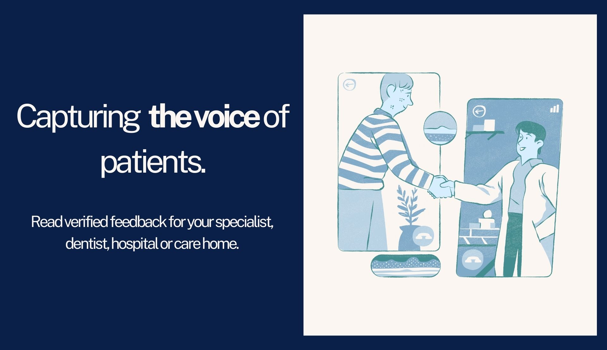

# [Team 6] MediLink
DEVELOP BRANCH  

  

MASTER BRANCH  

#### Access the MediLink Website:
[Production Link](http://medilink-prod.us-west-2.elasticbeanstalk.com/)  
[Integration Link](http://medilink-integration.eba-ywbzcdwm.us-west-2.elasticbeanstalk.com/)  

### What is this project?  
The project is a website that connects users with nearby hospitals, doctors, and healthcare centers by providing an intuitive platform to schedule appointments or to contact any facility during an emergency. For users looking for remote appointments, the website will allow them to find specialists or doctors based on the type of health problems they are facing. This would be achieved by creating a chat-based communication link with the professional to get online consultations. Using this feature, users will be able to get a rough diagnosis of their issue from home rather than having to visit a facility in person. However, users can also book appointments with a doctor or a hospital through our website. A map of nearby healthcare is also available in our project. The main goal of the project is to provide a straightforward solution to improving healthcare accessibility in the city of New York.

### What are the major features? 
1. List the publicly available Hospitals and Care Centres in the nearby vicinity of the user-selected area in NYC. The hospitals can be filtered based on specialty and type.
2. Book and manage appointments with the user’s preferred medical facility and include preferences such as accessibility needs in your booking.
3. Chat with your doctor online and receive prescriptions without stepping out of your house. The user can filter the doctors based on their needs and access past chats.
4. Post reviews and ratings, and interact with user suggestions to create a supportive community.
5. Add a map to show detailed doctors’ / hospitals’ locations and their ratings.

\
\
\
